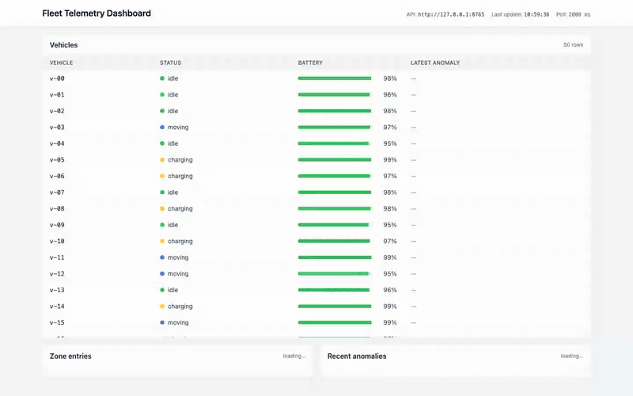

# Fleet Telemetry Monitoring

A small vertical slice of a fleet monitoring service for 50 autonomous industrial vehicles emitting telemetry at 1 Hz. Built as a take-home in a single session — see `ADR.md` for decisions and `ai-log.md` for the full AI interaction trace.



📹 **[Full 2:30 demo video (MP4)](demo/demo.mp4)** — silent, on-screen text overlays. The video visibly proves the two concurrency hot spots: 200 concurrent zone-entered POSTs land as an exact +200 delta on `charging_bay_1`, and 10 concurrent fault transitions on `v-33` produce exactly one maintenance record.

## What's here

- `backend/` — FastAPI + SQLite (WAL). 5 endpoints, 34 tests, atomic zone counter, atomic fault transition, deterministic anomaly rules.
- `frontend/` — Vite + React + TypeScript. Three components (vehicle list, zone counts, anomaly feed) polling at 2 s.
- `ADR.md` — one-page architecture decision record (decisions, assumptions, scale-up plan, deliberate omissions).
- `ai-log.md` — every prompt issued to subagents, every correction, the reflection at the end.
- `SPEC.md` — the original brief.
- `decisions.md` / `ambiguities.md` / `checklist.md` — working artifacts referenced by the ADR.

## Prerequisites

- Python 3.10+ (3.11 or 3.12 recommended)
- Node 18+ / npm 9+
- macOS or Linux. No Docker required.

## Run the backend

```bash
cd backend
python -m venv .venv
.venv/bin/pip install -r requirements.txt
.venv/bin/python -m uvicorn app.main:app --port 8765 --log-level warning
```

The first run creates `backend/telemetry.db`, applies WAL mode, and seeds 20 zones + 50 vehicles + 50 active missions.

The default port is `8765` because `8000` is commonly occupied (Docker, dev tools). Any free port works — just keep the frontend's `VITE_API_BASE` in sync.

OpenAPI docs: <http://127.0.0.1:8765/docs>.

## Run the frontend

```bash
cd frontend
npm install
npm run dev -- --host 127.0.0.1
```

Open <http://127.0.0.1:5173>. The dashboard polls every 2 s; the header shows the last-update timestamp.

If your backend is not on `127.0.0.1:8765`, set `VITE_API_BASE` before `npm run dev`:

```bash
VITE_API_BASE=http://127.0.0.1:9000 npm run dev -- --host 127.0.0.1
```

## Run the tests

```bash
cd backend
.venv/bin/python -m pytest -q
```

Expect 34 passed. The two notable concurrency tests:

- `test_200_concurrent_zone_entered_all_counted` — 200 concurrent zone-entry POSTs across 32 threads; final count must equal exactly 200.
- `test_10_concurrent_fault_transitions_idempotent` — 10 concurrent fault POSTs for the same vehicle; exactly one maintenance record, mission cancelled once.

## Try it by hand

Single event:

```bash
curl -s -X POST http://127.0.0.1:8765/telemetry \
  -H 'Content-Type: application/json' \
  -d '{"vehicle_id":"v-00","timestamp":"2026-05-15T18:00:00+00:00","lat":37.41,"lon":-122.08,"battery_pct":78,"speed_mps":1.2,"status":"moving","error_codes":[],"zone_entered":"aisle_a"}'
```

Batch (the endpoint accepts either a single object or an array):

```bash
curl -s -X POST http://127.0.0.1:8765/telemetry \
  -H 'Content-Type: application/json' \
  -d '[{"vehicle_id":"v-01","timestamp":"2026-05-15T18:00:00+00:00","lat":37.41,"lon":-122.08,"battery_pct":78,"speed_mps":7.5,"status":"moving","error_codes":[],"zone_entered":null}]'
```

Trigger a fault transition (atomic: cancels active mission + creates maintenance record):

```bash
curl -s -X POST http://127.0.0.1:8765/vehicles/v-00/status \
  -H 'Content-Type: application/json' \
  -d '{"new_status":"fault"}'
```

Read endpoints:

```bash
curl http://127.0.0.1:8765/fleet/state
curl http://127.0.0.1:8765/zones/counts
curl 'http://127.0.0.1:8765/anomalies?vehicle_id=v-00&limit=20'
curl http://127.0.0.1:8765/vehicles
```

The anomaly endpoint accepts an explicit time window via `?from=<ISO-8601>&to=<ISO-8601>` (the parameter names are exactly `from` and `to`, URL-encoded `+` as `%2B`). Without those, it defaults to the last 1 hour:

```bash
curl 'http://127.0.0.1:8765/anomalies?from=2026-05-15T00:00:00%2B00:00&to=2026-05-16T00:00:00%2B00:00&limit=200'
```

## Load smoke test

A standalone script that posts 50 vehicles × 60 events at 1 Hz (= 3,000 events, ~50 RPS, matching the spec's stated load):

```bash
TELEMETRY_URL=http://127.0.0.1:8765 \
  backend/.venv/bin/python backend/scripts/load_smoke.py
```

Last run: 3000/3000 successes, 0 errors, 60.8 s elapsed, zone-delta sum matched the client-side draw exactly.

## Reset the DB

```bash
rm backend/telemetry.db backend/telemetry.db-wal backend/telemetry.db-shm
```

The next backend start re-runs `init_db()`.

## QA & Verification

This project went through a parallel QA sweep before submission. All artifacts are in the repo.

- **`qa-report.md`** — aggregated triage across four parallel QA agents. Headline: 72/75 checks pass, zero P0, two P1 (both fixed). One alleged P0 (a "time-filter ignored" claim) was reproduced and rejected as a tester error — documented with evidence rather than silently dropped, so graders can see the QA process itself.
- **`backend/tests/qa_concurrency.py`** — three live-backend tests independent of the unit-test fixtures: 200-concurrent zone-counter burst, 10-concurrent fault transition on `v-20`, and fleet-state consistency under 1,000 streaming writes. Run with `.venv/bin/python -m pytest tests/qa_concurrency.py -v -s` against a running backend.
- **`qa-screenshots/`** — Playwright captures from frontend QA: initial 1440 px load, 375 px mobile view, final 1440 px state.
- **`qa-frontend-check.py`** — the Playwright script the frontend-qa agent ran (re-runnable).
- **`demo/record_demo.py`** — the script that produced `demo/demo.mp4` and `demo/demo-preview.gif`. Re-recordable end-to-end: launches headless Chromium, drives 14 beats with on-screen overlays, fires concurrent HTTP bursts mid-recording to prove the two hot spots, and transcodes via the static ffmpeg binary shipped with `imageio-ffmpeg` (no system ffmpeg required).

## Where to read what

- **Decisions and why** → `ADR.md` §1
- **Assumptions for unclear spec items** → `ADR.md` §2
- **Scale-up plan** → `ADR.md` §3
- **What's deliberately not here** → `ADR.md` §4
- **The full AI interaction trace** → `ai-log.md`
